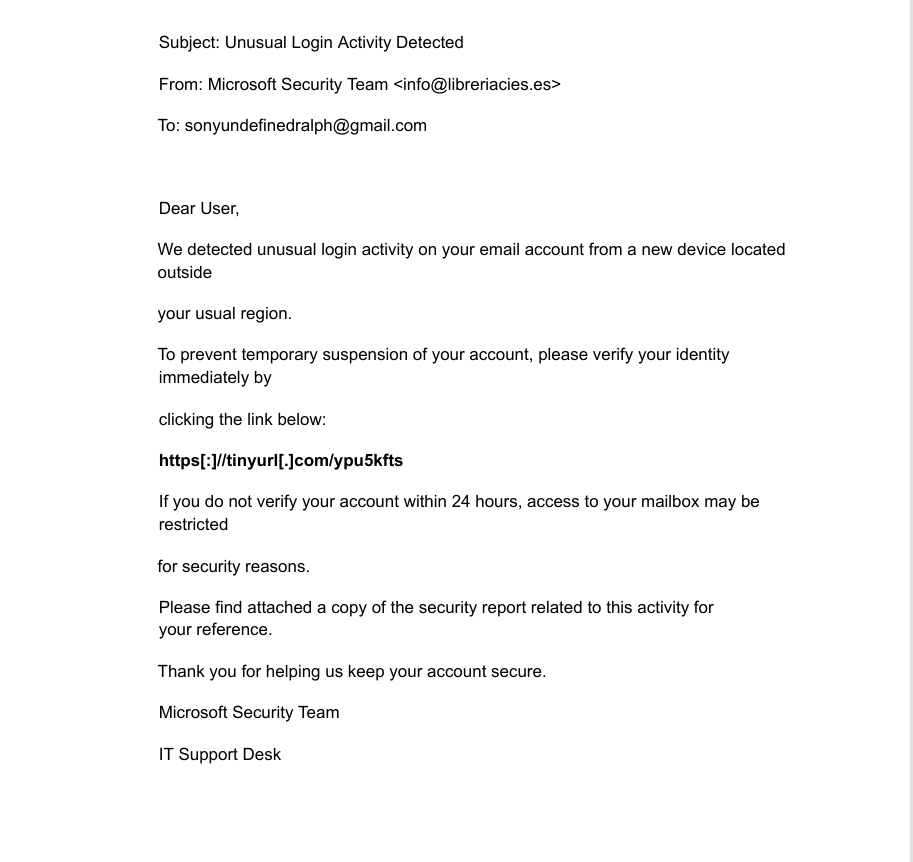
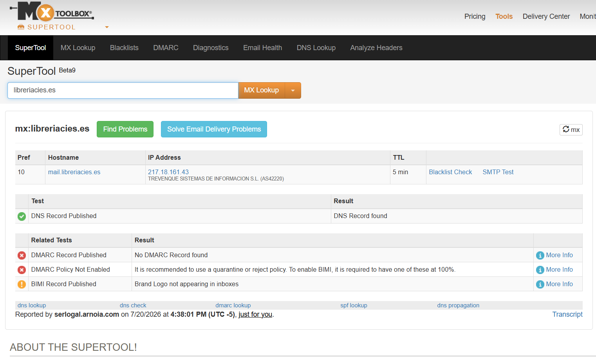
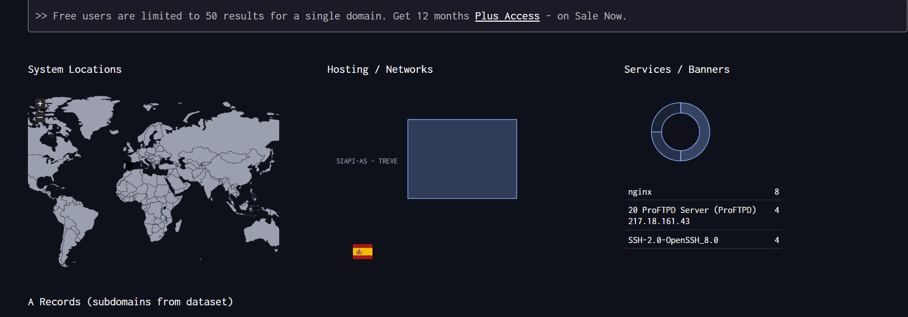
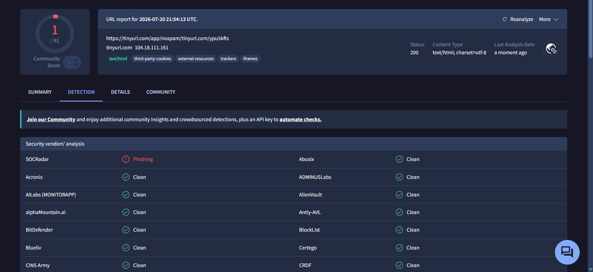
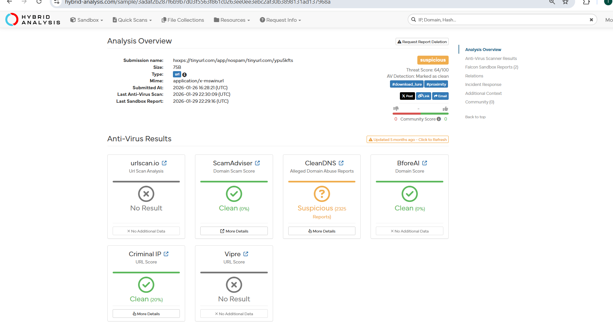
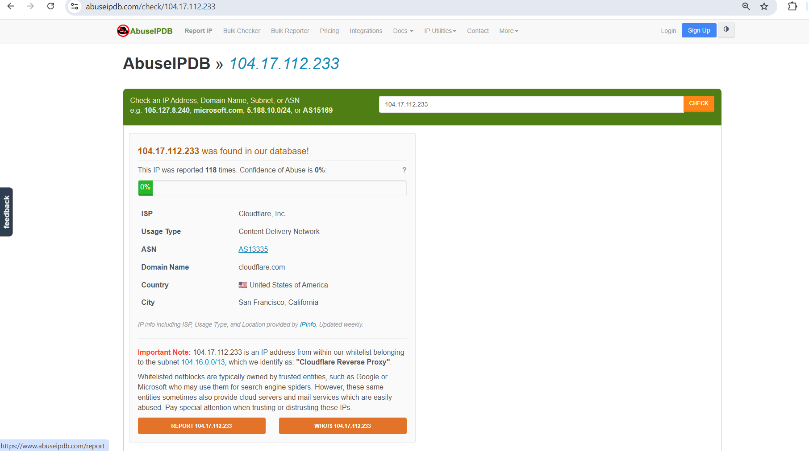

# Phishing Email Triage and IOC Extraction

---

##  At a Glance

| Field | Detail |
|-------|--------|
| Attack Type | Phishing, credential theft attempt |
| Vector | Email with spoofed sender identity and shortened link |
| Tools Used | Have I Been Pwned, MXToolbox, DNS Dumpster, VirusTotal, Hybrid Analysis, ScamAdviser, Criminal IP, Talos Intelligence, AbuseIPDB, Scamalytics |
| Target | End user mailbox, simulated environment |
| Outcome | Confirmed phishing, IOCs extracted and documented |

##  What Happened

An email arrived claiming to be from the Microsoft Security Team. It used urgency and a threat of account suspension to push the reader into acting fast.

Content is not evidence. The investigation set the wording aside and tested what the email could not fake: the sender identity, the domain behind it, and the link inside it.

##  Header and Sender Analysis

Sender name: Microsoft Security Team.
Sender email: info@libreriacies.es.

The display name and the domain do not match. Microsoft does not send security alerts from a Spanish book retailer's domain. That single mismatch is the sender telling on itself.

**Content indicators:**

- Urgent language: "verify immediately," "within 24 hours," "temporary suspension"
- Fear-based trigger: unusual login activity, account restriction
- Generic greeting: "Dear User" instead of a real name
- Poor formatting: no spacing, unprofessional layout
- Unexpected attachment labeled "security report," a common malware delivery tactic

**Link indicators:**

- Shortened URL: `https[:]//tinyurl[.]com/ypu5kfts`
- Brackets used to break the link and dodge automated detection
- True destination hidden behind the redirect

##  Email Address Check

The sender address has zero breach history on Have I Been Pwned. A clean breach history does not clear an address. It only means this specific inbox has not shown up in a public dump yet.

##  Domain Analysis

**MXToolbox results:**

- No DMARC record found
- DMARC policy not enabled
- DNS record published

A domain sending security alerts on behalf of Microsoft with no DMARC policy has no way to stop anyone from spoofing it further. That gap is a red flag on its own.

**DNS Dumpster results:**

- Hosting network: SIAPI-AS, Spain
- Services and banners: nginx, ProFTPD Server, SSH-2.0-OpenSSH_8.0 on 217.18.161.43
- Subdomains: ns1.libreriacies.es (217.18.161.43), ns2.libreriacies.es (217.18.165.34)
- MX record: 10mail.libreriacies.es (217.18.161.43)

None of this infrastructure connects to Microsoft. It points to a small Spanish hosting environment with no email authentication in place.

##  Link Analysis

The shortened URL expanded through CheckShortURL to a TinyURL anti-spam interstitial rather than a direct landing page, a common trick to slow down automated scanners.

**Results across threat intelligence platforms:**

| Source | Finding |
|--------|---------|
| VirusTotal | 1 of 92 vendors flagged the URL as phishing. Serving IP 104.18.111.161, United States |
| Hybrid Analysis | Threat score 64/100. AV detection marked clean |
| ScamAdviser | 0% risk shown as clean |
| Criminal IP | 20% clean rating |
| Talos Intelligence | Web reputation listed as favorable |
| AbuseIPDB | IP reported 118 times, mostly for phishing. 0% abuse confidence. ISP Cloudflare, San Francisco. Last report 1 week old |
| Scamalytics | Fraud score 0, low risk, no VPN or public proxy detected |

The scores conflict, and that conflict is the point. Reputation engines lag behind fresh infrastructure. Attackers rotate domains and IPs faster than blocklists update, so a clean score from one source next to a phishing flag and 95 abuse reports from others is normal for a live campaign, not a reason to clear the link.

##  Indicators Extracted

- Sender name and domain mismatch: claims Microsoft, sends from info@libreriacies.es
- No DMARC record on the sending domain
- Shortened URL with bracket obfuscation hiding the true destination
- Flagged by VirusTotal as phishing, threat score 64/100 on Hybrid Analysis
- Serving IP 104.17.112.233, reported 118 times on AbuseIPDB
- Urgency and fear-based language pushing immediate action
- Generic greeting and an unexpected attachment framed as a security report

##  Detection Logic

An email gets classified as phishing when the technical evidence stacks:

- Sender identity cannot be verified against the claimed domain
- The sending domain has no DMARC policy
- Links resolve through obfuscation to infrastructure with a phishing history
- Reputation signals conflict across sources, which fits an active campaign
- Content applies urgency to force action before verification

No single point convicts the email on its own. The combination does.

##  MITRE ATT&CK Mapping

| Tactic | Technique ID | Description |
|--------|-------------|-------------|
| Initial Access | T1566 | Phishing |
| Initial Access | T1566.002 | Spearphishing link |
| Defense Evasion | T1036 | Masquerading, domain impersonation |

##  Analyst Conclusion

This email is a phishing attempt, confirmed on header, domain, and link evidence.

The sender borrowed Microsoft's name while sending from an unrelated Spanish domain with no DMARC protection. The embedded link used a shortened, bracket-obfuscated URL that VirusTotal flagged as phishing and that carries a 64/100 threat score plus 95 prior abuse reports on its serving IP. Urgency language and a generic greeting round out a message built to bypass judgment, not earn trust.

Some platforms returned clean or low-risk scores. That split is expected against fresh or rotating attacker infrastructure, and it is why a verdict here rests on the full set of indicators, not any single tool.

##  Recommended Response

- Mark the email malicious and block the sender domain
- Submit the extracted URL and IP to threat intelligence platforms for tracking
- Add the IOCs to detection rules so the next instance is caught on delivery
- Issue a user awareness notice covering this specific lure pattern

##  Key Skills Demonstrated

- Spotting sender and domain impersonation through header and DMARC checks
- Investigating a shortened URL safely across multiple OSINT sources instead of clicking it
- Reading conflicting reputation data and reaching a verdict from the full picture, not one score
- Extracting IOCs in a form that can be actioned into blocklists and detection rules
- Mapping observed behavior to MITRE ATT&CK

##  Conclusion

This lab simulates a real-world phishing investigation and demonstrates the ability to triage a suspicious email, extract indicators of compromise, and reach a defensible verdict using multiple threat intelligence sources.

The investigation tested every layer of the email that could not be faked: the sender identity, the sending domain's authentication posture, and the link infrastructure behind the obfuscated URL. No single tool decided the outcome. The full picture did.

This project reflects practical blue team skills directly applicable to SOC analyst roles where phishing triage, IOC extraction, and threat intelligence correlation are daily responsibilities.

##  Repository Structure

phishing-email-triage/
├── README.md
├── LICENSE
└── screenshots/
    ├── header-sender-analysis.png
    ├── mxtoolbox-result.png
    ├── dns-dumpster-result.png
    ├── domaintools-result.png
    ├── virustotal-result.png
    ├── hybrid-analysis-result.png
    └── abuseipdb-result.png

---

## 📜 License

This project is licensed under the MIT License. See the LICENSE file for details.
